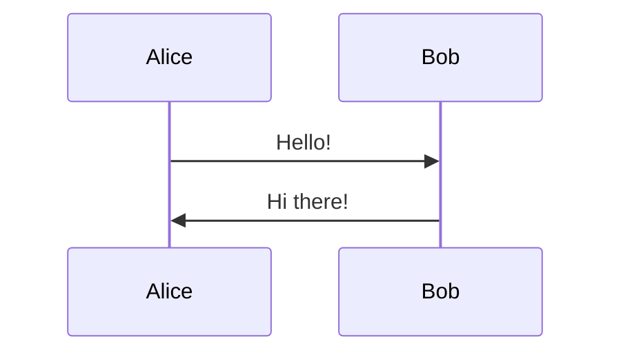

# Presenterm

Create terminal presentations from markdown files with code highlighting, diagrams, images, and professional themes.

## Quick Start

Create a markdown file with slides separated by `<!-- end_slide -->`:

````markdown
---
title: My Presentation
author: Your Name
---

# Welcome

This is the first slide.

<!-- end_slide -->

# Second Slide

- Bullet point
- Another point

<!-- end_slide -->

# Code Example

```python
def hello():
    print("Hello, World!")
```
````

````

Run: `presenterm presentation.md`

## Slide Structure

### Front Matter (Optional Intro Slide)

```yaml
---
title: "Presentation Title"
sub_title: "Optional subtitle"
author: Author Name
theme:
  name: catppuccin-mocha
---
````

Multiple authors: use `authors: [Name1, Name2]`

### Slide Separators

Use `<!-- end_slide -->` to mark slide boundaries.

## Commands Reference

All commands use HTML comment syntax `<!-- command -->`:

| Command             | Purpose                        | Example                            |
| ------------------- | ------------------------------ | ---------------------------------- |
| `end_slide`         | End current slide              | `<!-- end_slide -->`               |
| `pause`             | Reveal content progressively   | `<!-- pause -->`                   |
| `incremental_lists` | Make lists reveal item-by-item | `<!-- incremental_lists: true -->` |
| `jump_to_middle`    | Center content vertically      | `<!-- jump_to_middle -->`          |
| `newlines: N`       | Add N blank lines              | `<!-- newlines: 3 -->`             |
| `font_size: N`      | Set font size 1-7              | `<!-- font_size: 2 -->`            |
| `alignment: X`      | Align text (left/center/right) | `<!-- alignment: center -->`       |
| `no_footer`         | Hide footer on slide           | `<!-- no_footer -->`               |
| `skip_slide`        | Exclude from presentation      | `<!-- skip_slide -->`              |
| `include: file.md`  | Include external markdown      | `<!-- include: outro.md -->`       |

## Code Blocks

### Syntax Highlighting

50+ languages supported. Use fenced code blocks:

````markdown
```python
def example():
    return "highlighted"
```
````

### Line Highlighting

Highlight specific lines with `{lines}`:

````markdown
```rust {1,3,5-7}
fn main() {
    let x = 1;  // Line 1: highlighted
    let y = 2;  // Line 2: not highlighted
    let z = 3;  // Line 3: highlighted
}
```
````

### Progressive Reveal

Use `|` to reveal code in stages:

````markdown
```python {1-2|3-4|5}
def greet(name):
    """Greeting function."""
    message = f"Hello, {name}!"
    print(message)
    return message
```
````

### Code Attributes

| Attribute        | Purpose                      |
| ---------------- | ---------------------------- |
| `+line_numbers`  | Show line numbers            |
| `+no_background` | Remove background            |
| `+exec`          | Make executable (Ctrl+E)     |
| `+exec_replace`  | Auto-execute and show output |

### External Code Files

````markdown
```file
path: src/main.rs
start_line: 10
end_line: 20
```
````

## Layout

### Column Layout

```markdown
<!-- column_layout: [1, 2] -->

<!-- column: 0 -->

Left column (1/3 width)

<!-- column: 1 -->

Right column (2/3 width)

<!-- reset_layout -->

Full width again
```

Ratios define proportional widths: `[1, 2]` = 33% + 66%

### Centering Content

Use uneven ratios: `[1, 3, 1]` centers the middle column.

## Images

Standard markdown syntax:

```markdown


```

Sizing options:

- `image:width:50%` or `image:w:50%` - percentage of terminal width
- Images auto-scale if too large

**Requirements:** Terminal must support graphics protocol (kitty, iterm2, WezTerm, ghostty, foot).

## Diagrams

### Mermaid (requires mermaid-cli)

````markdown

````

### D2 (requires d2)

````markdown
```d2 +render
server -> database: query
database -> server: results
```
````

Use `+width:50%` to control diagram size.

## Formulas

### LaTeX (requires pandoc + typst)

````markdown
```latex +render
\sum_{n=1}^{\infty} \frac{1}{n^2} = \frac{\pi^2}{6}
```
````

### Typst (requires typst)

````markdown
```typst +render
$ integral_0^infinity e^(-x^2) dif x = sqrt(pi)/2 $
```
````

## Themes

### Built-in Themes

- `dark`, `light`
- `catppuccin-latte`, `catppuccin-frappe`, `catppuccin-macchiato`, `catppuccin-mocha`
- `gruvbox-dark`, `tokyonight-storm`
- `terminal-dark`, `terminal-light` (inherit terminal colors)

### Apply Theme

In front matter:

```yaml
theme:
  name: catppuccin-mocha
```

Or CLI: `presenterm --theme dark presentation.md`

### Theme Overrides

```yaml
theme:
  name: dark
  override:
    default:
      colors:
        foreground: 'e6e6e6'
```

## Speaker Notes

Add notes visible only to presenter:

```markdown
<!-- speaker_note: Remember to explain this concept -->

<!--
speaker_note: |
  Multi-line note
  with details
-->
```

Run two instances:

1. Main: `presenterm presentation.md --publish-speaker-notes`
2. Notes: `presenterm presentation.md --listen-speaker-notes`

## Exports

### PDF Export (requires weasyprint)

```bash
presenterm --export-pdf presentation.md
presenterm --export-pdf presentation.md --output slides.pdf
```

### HTML Export (no dependencies)

```bash
presenterm --export-html presentation.md
```

## Navigation

| Key                            | Action         |
| ------------------------------ | -------------- |
| `→` `↓` `l` `j` `Space` `PgDn` | Next slide     |
| `←` `↑` `h` `k` `PgUp`         | Previous slide |
| `gg`                           | First slide    |
| `G`                            | Last slide     |
| `<n>G`                         | Go to slide n  |
| `Ctrl+P`                       | Slide index    |
| `?`                            | Key bindings   |
| `Ctrl+E`                       | Execute code   |
| `Ctrl+C`                       | Exit           |

## Detailed Reference

For complete syntax details including advanced theming, see [references/syntax.md](references/syntax.md).

## Templates

Starter templates available in [assets/templates/](assets/templates/):

- `basic.md` - Simple presentation structure
- `technical.md` - Code-focused presentation with diagrams
- `split-layout.md` - Multi-column layout example

## Validate

```bash
presenterm --export-html presentation.md --output /tmp/evals-test.html
```
