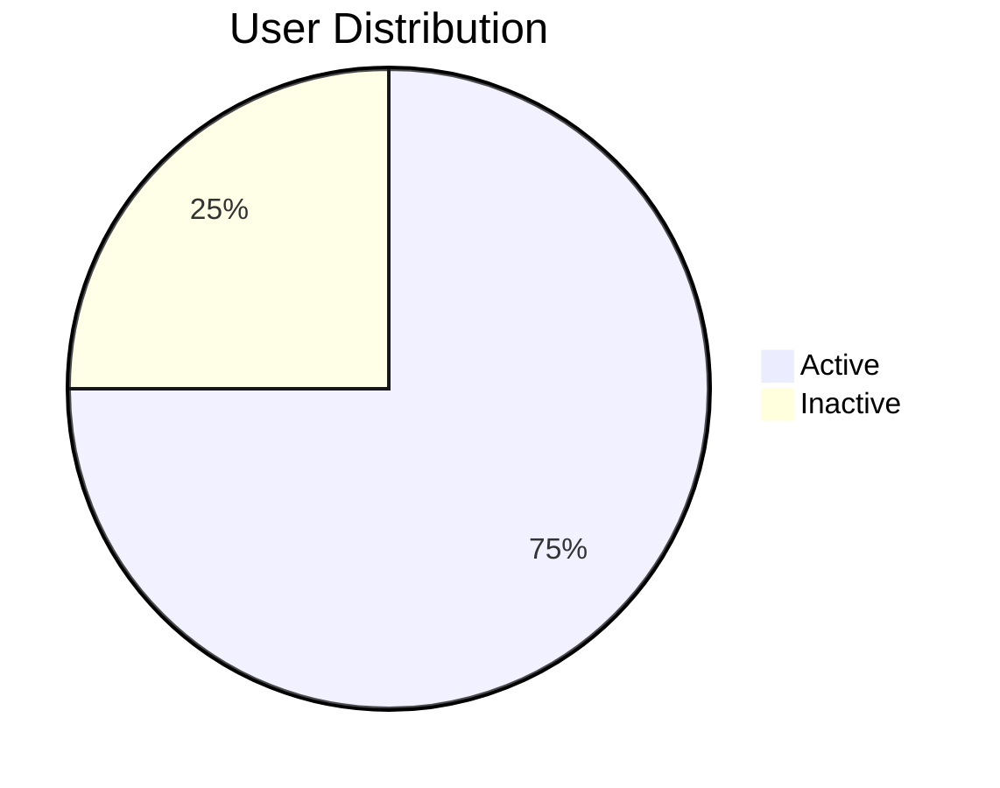

# Two Column Layout

<!-- column_layout: [1, 1] -->

<!-- column: 0 -->

## Left Side

Content on the left:
- Point A
- Point B
- Point C

<!-- column: 1 -->

## Right Side

Content on the right:
- Point X
- Point Y
- Point Z

<!-- end_slide -->

# Asymmetric Layout

<!-- column_layout: [2, 1] -->

<!-- column: 0 -->

## Main Content (2/3 width)

This is the primary content area with more space
for detailed explanations and examples.

```python
def main():
    print("Hello from main!")
```

<!-- column: 1 -->

## Sidebar

Quick facts:
- Fact 1
- Fact 2
- Fact 3

<!-- end_slide -->

# Three Columns

<!-- column_layout: [1, 1, 1] -->

<!-- column: 0 -->

### Option A

Description of option A with its benefits.

<!-- column: 1 -->

### Option B

Description of option B with its benefits.

<!-- column: 2 -->

### Option C

Description of option C with its benefits.

<!-- end_slide -->

# Centered Content

<!-- column_layout: [1, 3, 1] -->

<!-- column: 1 -->

## Centered Title

This content is centered on the slide
using empty side columns.

<!-- jump_to_middle -->

**Key Message Here**

<!-- end_slide -->

# Code + Explanation

<!-- column_layout: [3, 2] -->

<!-- column: 0 -->

```python +line_numbers
class DataProcessor:
    def __init__(self, config):
        self.config = config

    def process(self, data):
        validated = self.validate(data)
        transformed = self.transform(validated)
        return self.output(transformed)
```

<!-- column: 1 -->

## How It Works

1. **Initialize** with config
2. **Validate** input data
3. **Transform** to output format
4. **Return** processed result

<!-- end_slide -->

# Image + Text

<!-- column_layout: [1, 1] -->

<!-- column: 0 -->

## Description

Place your explanation text here
alongside the image.

Key features:
- Feature one
- Feature two
- Feature three

<!-- column: 1 -->


<!-- end_slide -->

# Mixed Layout

<!-- column_layout: [1, 2] -->

<!-- column: 0 -->

### Stats

| Metric | Value |
|--------|-------|
| Users  | 1000  |
| Active | 750   |
| Growth | 15%   |

<!-- column: 1 -->

### Trend



<!-- reset_layout -->

**Note:** Full-width content after reset_layout

<!-- end_slide -->

# Thank You

<!-- column_layout: [1, 2, 1] -->

<!-- column: 1 -->

<!-- jump_to_middle -->

## Questions?

Contact: your@email.com
