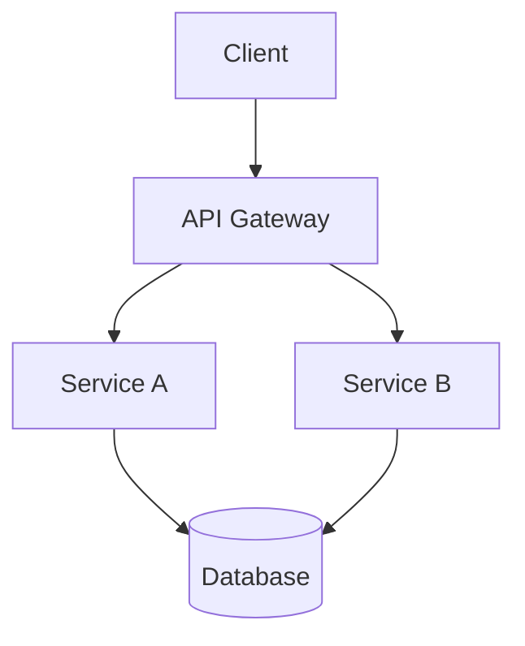
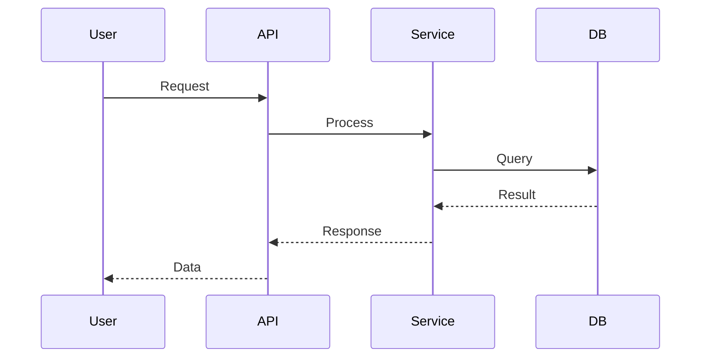

# Agenda

<!-- incremental_lists: true -->

- Problem Statement
- Architecture Overview
- Code Walkthrough
- Demo
- Q&A

<!-- end_slide -->

# Problem Statement

## The Challenge

Describe the technical problem you're solving.

<!-- pause -->

**Constraints:**
- Constraint one
- Constraint two
- Constraint three

<!-- end_slide -->

# Architecture

## System Overview



<!-- end_slide -->

# Data Flow

## Sequence Diagram



<!-- end_slide -->

# Code Walkthrough

## Implementation

```python {1-3|5-8|10-12} +line_numbers
# Configuration
import os
config = load_config()

# Core logic
def process_data(input):
    validated = validate(input)
    return transform(validated)

# Entry point
if __name__ == "__main__":
    run_server()
```

<!-- speaker_note: Walk through each highlighted section -->

<!-- end_slide -->

# Live Demo

## Running the Code

```python +exec
def fibonacci(n):
    if n <= 1:
        return n
    return fibonacci(n-1) + fibonacci(n-2)

print([fibonacci(i) for i in range(10)])
```

<!-- speaker_note: Press Ctrl+E to execute -->

<!-- end_slide -->

# Performance

## Complexity Analysis

```latex +render
O(n) = \sum_{i=1}^{n} c_i \approx O(n \log n)
```

<!-- pause -->

**Benchmarks:**
| Operation | Time (ms) | Memory (MB) |
|-----------|-----------|-------------|
| Insert    | 1.2       | 0.5         |
| Query     | 0.8       | 0.2         |
| Delete    | 1.0       | 0.3         |

<!-- end_slide -->

# Summary

## What We Covered

- Problem and constraints
- Architecture design
- Implementation details
- Performance characteristics

<!-- pause -->

## Next Steps

1. Review the codebase
2. Run locally
3. Submit feedback

<!-- end_slide -->

# Questions?

<!-- jump_to_middle -->

**Repository:** github.com/example/project

**Docs:** docs.example.com
