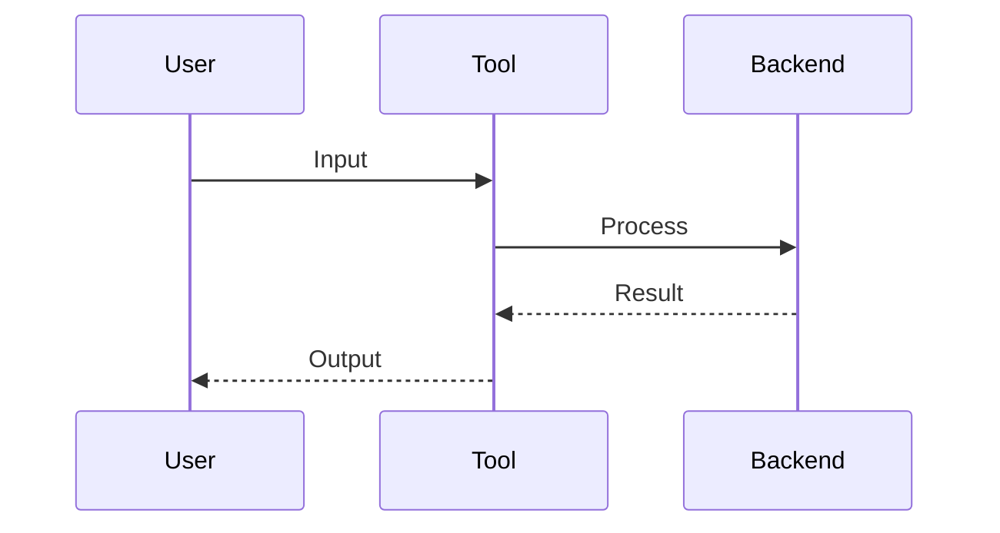

# Watch This

<!-- jump_to_middle -->

```python +exec
# COLD OPEN: Show the impressive result immediately
# No context needed - just the "wow" moment

def impressive_demo():
    # Your most compelling example
    return "Mind = Blown"

print(impressive_demo())
```

<!-- speaker_note: Start with impact. Explanations come later. -->

<!-- end_slide -->

# What Just Happened?

## Let's Break It Down

You just saw:

<!-- incremental_lists: true -->

- **Step 1** - what happened first
- **Step 2** - the key transformation
- **Step 3** - the final result

<!-- pause -->

Now you're curious _how_ it works...

<!-- end_slide -->

# The Core Concept

## How It Works

```
// High-level mental model
input → [Your Magic] → output

// The key insight:
magic = {
  principle_1: "why this matters",
  principle_2: "what makes it possible"
}
```

<!-- end_slide -->

# Under The Hood

## Architecture



<!-- end_slide -->

# Let's Build One

## Step 1: Setup

```python +line_numbers
# First, we configure
from your_tool import Client

client = Client(
    api_key="your-key",
    options={"feature": True}
)
```

<!-- speaker_note: Keep setup minimal. Focus on the interesting parts. -->

<!-- end_slide -->

# Let's Build One

## Step 2: Core Logic

```python {3-5} +line_numbers
# The interesting part
def process(input):
    prepared = client.prepare(input)
    result = client.execute(prepared)
    return client.format(result)

output = process("your input")
```

<!-- pause -->

Notice line 4: _this is where the magic happens_

<!-- end_slide -->

# Let's Build One

## Step 3: Full Example

```python +exec
# Putting it all together
def full_example():
    # Setup
    config = {"mode": "demo"}

    # Process
    result = process_with_config(config, "input")

    # Output
    return f"Result: {result}"

# Replace with your actual code
print("Demo: " + full_example())
```

<!-- end_slide -->

# Variations

## What Else Can It Do?

<!-- column_layout: [1, 1] -->

<!-- column: 0 -->

### Use Case A

```python
# Variation 1
client.mode = "A"
result = client.run()
```

<!-- column: 1 -->

### Use Case B

```python
# Variation 2
client.mode = "B"
result = client.run()
```

<!-- speaker_note: Show versatility without overwhelming. -->

<!-- end_slide -->

# Key Concepts

## What To Remember

```
concepts = {
  core:     "the main idea",
  pattern:  "how to think about it",
  gotcha:   "common mistake to avoid"
}

// WHEN TO USE:
use_when = [
  "scenario 1",
  "scenario 2"
]

// WHEN NOT TO USE:
avoid_when = [
  "edge case"
]
```

<!-- end_slide -->

# Your Turn

<!-- jump_to_middle -->

**Get Started:**

```bash
npm install your-tool
# or
pip install your-tool
```

**Docs:** docs.yourtool.com

<!-- pause -->

Questions?
