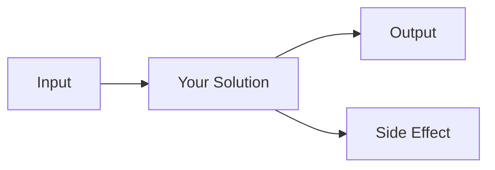

# The Hook

<!-- jump_to_middle -->

**"A surprising stat or bold claim goes here"**

<!-- pause -->

or: A question that makes them think?

<!-- speaker_note: Start strong. You have 30 seconds to grab attention. -->

<!-- end_slide -->

# The Problem

## We've all been here

Describe the painful situation everyone knows:

- Symptom 1 that's frustrating
- Symptom 2 that wastes time
- Symptom 3 that costs money

<!-- speaker_note: Build empathy. Use specific examples. -->

<!-- end_slide -->

# Why It's Hard

## Failed Attempts

<!-- incremental_lists: true -->

- **Approach A** - why it falls short
- **Approach B** - the tradeoff that hurts
- **Approach C** - almost works, but...

<!-- pause -->

The real constraint: _what makes this genuinely difficult_

<!-- end_slide -->

# The Insight

<!-- jump_to_middle -->
<!-- alignment: center -->

**"The key realization that unlocks the solution"**

<!-- speaker_note: This is your "aha" moment. Let it land. -->

<!-- end_slide -->

# Our Approach

## High-Level Solution

```
solution = {
  core_idea:    "one sentence",
  key_benefit:  "why this works",
  tradeoff:     "what we give up"
}
```

<!-- pause -->

The main difference: _what sets this apart_

<!-- end_slide -->

# How It Works

## Architecture



<!-- speaker_note: Keep the diagram simple. You'll explain the details. -->

<!-- end_slide -->

# In Practice

## The Code

```python {1-3|5-7} +line_numbers
# Setup
config = load_config()
client = init_client(config)

# The magic happens here
result = client.process(input)
print(result)  # ← what you get
```

<!-- speaker_note: Walk through each highlighted section. -->

<!-- end_slide -->

# Demo

## Watch This

```python +exec
# Live demo code here
def demo():
    return "Replace with your actual demo"

print(demo())
```

<!-- speaker_note: Keep demos short. Have a backup if live coding fails. -->

<!-- end_slide -->

# Results

## What We Achieved

<!-- column_layout: [1, 1] -->

<!-- column: 0 -->

### Before

- Metric 1: bad
- Metric 2: slow
- Metric 3: expensive

<!-- column: 1 -->

### After

- Metric 1: good
- Metric 2: fast
- Metric 3: cheap

<!-- speaker_note: Use real numbers if you have them. -->

<!-- end_slide -->

# Key Takeaways

<!-- incremental_lists: true -->

- **Takeaway 1** - the most important thing
- **Takeaway 2** - the practical insight
- **Takeaway 3** - what to do next

<!-- end_slide -->

# Try It Yourself

<!-- jump_to_middle -->

**Repository:** github.com/your/project

**Docs:** docs.yourproject.com

<!-- pause -->

Questions?

<!-- speaker_note: Leave time for Q&A. Have backup slides ready. -->
